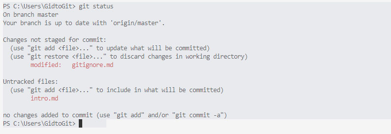

< [к содержанию](./readme.md)
### Работа с локальным репозиторием
#### **Основные комманды**

`git init` создает каталог с именем .git, в котором будут храниться структурные файлы репозитория

`git clone` клонирует (создает копию) репозитория

`git status` просмотр состояния файлов в созданном репозитории (показывает на какой ветке вы сейчас находитесь и состояние всех файлов)

Например, запуск `git status` на рабочем репозитории:

На данной картинке можно увидеть названия 2 файлов и их характеристики: *Modified* и *Untracked files*.

Файлы могут быть не отслеживаемые (*Untracked*) и отслеживаемые. 

Отслеживаемые файлы могут находится в 3 состояниях: 

* не изменено (*Unmodified*) 
* изменено (*Modified*) 
* подготовленно (*Staged*).

Если добавляются (с помощью `git add`) «Не отслеживаемый» файл, то он переходит в состояние «Подготовлено».

Если сохраняется изменённый файл (то есть находящийся в состоянии «Изменено») он переходит в состояние «Подготовлено». 

Если производится коммит файла (то есть находящийся в состоянии «Подготовлено») он переходит в состояние «Не изменено».

Этот цикл можно представить следующим образом:
***Unmodified*** &#8594; ***Modified*** &#8594; ***Staged*** &#8594; ***Unmodified***

То есть изначально файл меняется, а затем, сохраняется в индексе, после чего осуществляется коммит и потом все сначала.

`git add` -позволяет внести в индекс — временное хранилище — изменения, которые затем войдут в коммит

**Примеры:**

|       Команда               |    Расшифровка                                                 |
|----------------------|-----------------------------------------------------|
| `git add index.html` | вносит изменения файла index.html в индекс          |
| `git add .`          | вносит все изменения, включая новые файлы, в индекс |

`git restore --staged <file>` удаляет из индекса некоторые файлы

`git commit` создает коммит изменений

`git reset` изымает ошибочно закоммиченный файл

`git log` просмотр всех выполненных фиксаций (история коммитов)

`git show hash_commit` отслеживает интересующие операции из списка изменений (по хэшу коммита)

[далее](./server.md) >