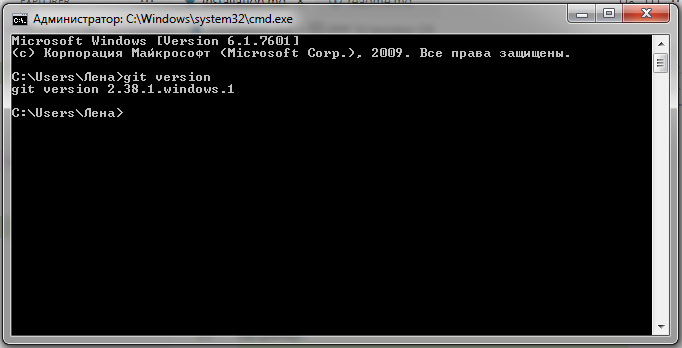

### Установка Git

[Скачиваем файл для установки GIT](https://git-scm.com/downloads)

Открываем файл и запускаем автоматическую установку.

Далее открываем командную стройку и вводим:

``` 
>git version 
```
В окошке командной строки отобразится версия установленного GIT.
Например:


### Настройка Git

После установки Git можно произвести первоначальную настройку основных параметров.

Установливаем имя пользователя
```
git config --global user.name "<your-Name>
```
Установливаем email
```
git config --global user.email "<your-email@email.com>"
```